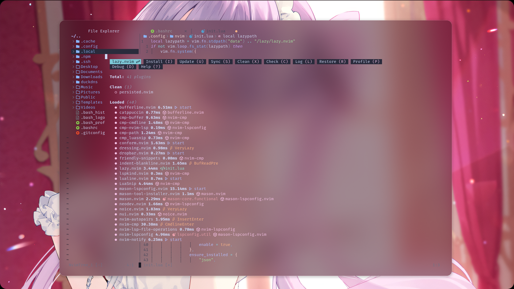
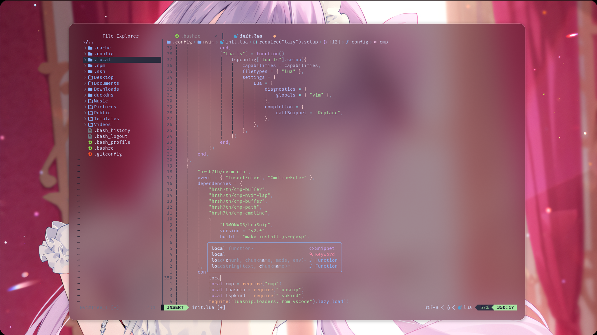

# init.lua
minimal init.lua i like to use for vms/servers

 



# plugins
- lazy package manager
- catpuccin colorscheme
- conform.nvim
- nvim-cmp
- nvim-treesitter
- mason.nvim
- lualine.nvim
- which-key.nvim
- nvim-tree.lua
- telescope.nvim
- noice.nvim
- and more!


# requirements
- a nerd font (im using JetBrainsMono Nerd Font)
- ripgrep
- fd
- gcc
- npm
- luarocks (only needed for lua_ls. if you dont want lua_ls remove from the ```ensure_installed section on line 106```)

# bindings

## buffers
- shift + h to move to previous buffer
- shift + l to move to next buffer
- space + bd to close buffer

## nvim-tree
- control + n for file tree

## telescope
- space + ff for telescope
- space + fg for telescope grep
- space + fr for recent files
## genereal
- alt + left/right/up/down for changing windows size
- control + h/l for moving window ( ie from neovim to filetree)
- space + pl to open lazy
- space + pm to open mason

## splits
- space + | vertical split
- space + - horizontal split
